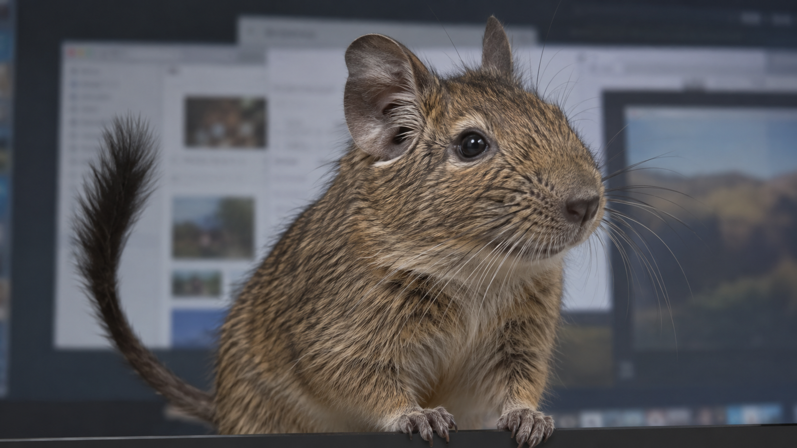

# デグー出現演出・写真寄りラフ



## 狙い

- 画面下から大きなデグーが短く飛び出し、周囲を見て引っ込む。
- 全画面オーバーレイ上に表示し、デグーは画面幅の約60%、高さの約65%を占める。
- くつろぎ・睡眠・長時間の居座りは入れない。出現頻度は後で調整できるようにする。
- 動画制作時はデスクトップ背景を入れず、デグー単体を均一なクロマキー背景で生成する。最終表示時は背景を抜いて透過動画として重ねる。

## ImageGen に使用したプロンプト

```text
Use case: photorealistic-natural. Asset type: revised visual concept mockup for a large degu appearing briefly across a computer desktop. One single 16:9 cinematic still. A TRUE-TO-LIFE adult common degu (Octodon degus), photographed with realistic wildlife macro photography: natural compact rodent proportions, slender tapered muzzle, small dark nose, dark eyes of normal size set toward the sides of the head, proportionate rounded ears (not oversized), dense slightly coarse agouti fur with mixed gray-brown and tawny guard hairs, pale chin, long fine whiskers, small dexterous front paws, thin long tail ending in a dark brush-like tuft. The degu rises suddenly from the lower edge of a computer screen and peeks into the user's workspace, with head, chest, forepaws and curving tail visible. It is very large as an on-screen overlay, occupying around 60% of screen width and 65% of screen height, but still anatomically realistic, as if genuine animal footage enlarged over the desktop. Alert curious posture, slight three-quarter angle, lively but calm, an instant before ducking back down. Behind it is a generic dimmed computer desktop with softly blurred ordinary windows, no recognizable brands or readable text. The animal silhouette is crisp and separated from the desktop, with photographic fur detail, subtle natural imperfections, neutral daylight color, no cartoon rendering, no 3D render, no stylized eyes, no hamster, no squirrel, no mouse, no chubby inflated cheeks, no human hands, no cage, no food, no labels, no UI controls, no sleeping or lounging. The image should feel like a believable frame from a real animal video composited over a desktop, not an illustration.
```

## Google Flow 用の動画指示案

```text
One single lifelike adult common degu (Octodon degus), matching the supplied degu appearance reference. Static camera, full animal within frame at all times, 16:9. A short playful pop-up action: rise briskly from below, pause to look around and twitch nose and ears, then duck back down. Natural animal motion, realistic anatomy and fur. Duration about 3 seconds. The backdrop is flat, uniform, saturated pure chroma green (#00FF00) across every frame. No desktop, scenery, floor, shadow, gradient, green spill, other animals, props, captions, sleeping, or lingering. Keep the animal's silhouette clear and consistent for chroma key extraction.
```

この画像は表示イメージの検討用。実際の動きは下記の Flow 動画で確認する。

## アグーチ・動き3パターン

同じ成体デグーのアグーチカラーを基準にする。短く現れて、少し反応し、画面から消える。各動画は16:9、約4秒、固定カメラ、デグー1匹、無地の緑背景を想定。

| パターン | ピーク場面 | 動き |
| --- | --- | --- |
| A 下からぴょこ | [画像](degu-pop-photoreal-v2.png) | 画面下から上昇 → 鼻と耳を動かして一瞬見る → 下へ戻る |
| B 横からのぞく | [画像](degu-side-peek-agouti.png) | 右から顔と前足を出す → 首を少し傾げる → 右へ戻る |
| C 跳び込んで見回す | [画像](degu-center-hop-agouti.png) | 左下から中央へ短く跳ぶ → 立ち止まって見回す → 左下へ戻る |

Flow の外見参照候補は [緑背景のアグーチ画像](degu-agouti-chroma-reference.png)。画像の緑は完全に一様ではないので、動画生成後のキー抜きで背景と毛先を確認する。

### Flow 動画プロンプト共通部分

```text
Use the uploaded image only as the appearance reference for the same single photoreal adult agouti common degu (Octodon degus). Preserve its accurate natural anatomy, coarse gray-brown and tawny agouti fur, pale chin, normal-size dark eyes, proportionate ears, thin tail with dark tuft, and fine whiskers. One continuous 16:9 shot, static camera, 4 seconds. Vivid flat chroma green background throughout, no desktop, no floor, scenery, shadow, gradient, camera movement, text, props, other animals, stylization, sleeping, or lounging. Keep realistic movement and a clear animal silhouette for chroma key extraction.
```

### A 下からぴょこ

```text
The degu is initially out of view below the lower frame edge. It quickly rises into the central foreground until its head, chest, and forepaws are large and clearly visible. It briefly sniffs with a tiny nose twitch and one ear flick, looks toward the viewer, then ducks back below the lower edge. A playful spontaneous visit, not a rest or a loop. Keep the backdrop completely green even when the degu leaves the frame.
```

### B 横からのぞく

```text
The degu is initially out of view beyond the right edge. It quickly peeks in from the right, putting its head and one forepaw across the screen and occupying much of the right half. It pauses briefly, tilts its head a little and flicks its whiskers, then pulls back out to the right. The movement is small and natural, not a long hold or a rest. Keep the backdrop completely green even when the degu leaves the frame.
```

### C 跳び込んで見回す

```text
The degu makes one short natural hop from below the lower-left edge into the center foreground, landing on an invisible plane just below the frame. It briefly glances left and right with small nose and ear movements, then makes one short hop back out through the lower-left edge. Energetic but anatomically plausible; no floating, human-like gesture, or extra limbs. Keep the backdrop completely green even when the degu leaves the frame.
```

## Flow 試作結果（2026-09-23）

[Flow プロジェクト](https://flow.google.com/project/cff57249-b52f-4d1a-aa8e-6011b257a69d)で、アグーチの参照画像を素材にして Omni 1.1 Flash・16:9・720p・4秒の動画を3本生成した。緑背景の元動画を保存し、ffmpeg で緑を抜いて緑かぶりを抑えた。透過マスターは ProRes 4444 MOV、軽量版はアルファ付き VP9 WebM。

| 動き | 配布に使用する透過 WebM | 緑背景の元動画 |
| --- | --- | --- |
| A 下からぴょこ | [WebM](../assets/videos/agouti-a-bottom-pop.webm) | [MP4](flow-raw/agouti-a-bottom-pop.mp4) |
| B 横からのぞく | [WebM](../assets/videos/agouti-b-side-peek.webm) | [MP4](flow-raw/agouti-b-side-peek.mp4) |
| C 跳び込んで見回す | [WebM](../assets/videos/agouti-c-center-hop.webm) | [MP4](flow-raw/agouti-c-center-hop.mp4) |

3本とも 1280×720、24fps、4秒。透過 MOV は `yuva444p12le`、WebM は `alpha_mode=1` を確認した。暗色・明色背景に重ねたサンプルフレームを `flow-raw/qa/` に保存した。

確認メモ：A は下から出て下へ戻り、C は左下から入り左へ出る。B は右から入るが、首かしげより歩き出しに近い。B と C の足元に生成時の薄い影が残り、透過後も少し見える。

### 緑の縁の修正（2026-09-23）

元動画の緑は純粋な `#00FF00` ではなく、場面によって約 `#11DF21` などに変化していた。旧版の一定色に対するクロマキーでは、毛先の半透明部分に色かぶりが残った。`scripts/key_chroma.py` で各フレームの背景色を測ってアルファを作り、輪郭の色を毛の内側から延長した。さらに半透明の縁の緑成分を抑えた。以前の出力は `flow-alpha-v1/` と `flow-alpha-v2/` に保存し、上の透過 MOV・WebM とプレビューを修正版に差し替えた。3本の0.5・1.5・2.5・3.5秒を明色・暗色背景で確認済み。B の耳付近（1.5秒）の半透明画素では、緑成分が赤・青の中間値より8以上強い画素が1319から0になった。B の足元の薄い影は元動画由来として残る。

## 毛色追加と1080p（2026-09-23）

サンドとホワイトは、毛色ごとに ImageGen で作った基準画像を Flow に渡し、A/B/C の3動作をそれぞれ生成した。Google Flow Pro の1080pアップスケールを Chrome で行い、保存した1920×1080・4秒の MP4 を `scripts/process_clip.py` で緑抜きしてアルファ付き VP9 WebM にした。配布用ファイルは `assets/videos/` に置き、元の MP4 はローカルの `flow-raw/` に保管する。

`process_clip.py` は `key_chroma.py` と同じ輪郭補正を使い、ProRes の中間ファイルを作らず直接 WebM にする。出力の `alpha_mode=1` を確認してから採用する。
