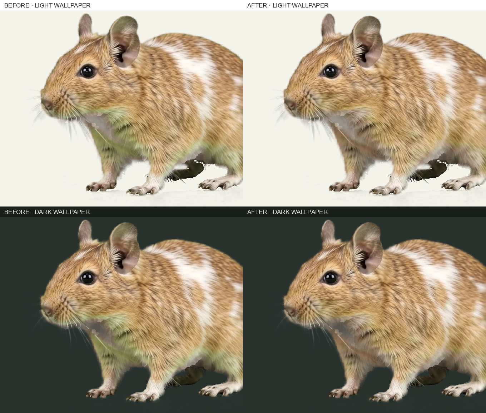

# Chroma spill review · 2026-09-24

The user noticed green in the pied coat's chest fur. At 2 seconds, `sand_pied-b-side-peek.webm` showed olive fur under the jaw and across the chest. A visual pass of all 39 clips on a neutral background also found similar spill in four other clips.

The source Flow MP4s remain under local `concept/flow-raw/`; the original transparent WebMs are recoverable from Git commit `9199912`. Only the five clips below were reprocessed. `scripts/key_chroma.py` now lowers the green channel in opaque warm pixels whose hue matches chroma spill. It leaves neutral white and gray pixels and soft alpha edges alone.

| Clip | Olive-colored opaque pixels before → after |
| --- | ---: |
| `sand_pied-b-side-peek` | 15.1% → 2.3% |
| `sand-c-center-hop` | 16.4% → 1.2% |
| `lilac-b-side-peek` | 21.0% → 10.0% |
| `white-b-side-peek` | 21.1% → 16.9% |
| `chocolate-b-side-peek` | 9.1% → 2.5% |

The measure is the largest of three sampled frames (1, 2, and 3 seconds): among pixels with alpha at least 80%, count those with `red − blue > 25` and `green ≥ red − 10`. It is a screening measure, not a color quality score; pale shadows in the white and lilac clips can meet the rule without looking green. The alpha silhouette area at 50% opacity was unchanged in those samples. All 39 clips passed `scripts/audit_videos.py` after reprocessing.

