<!-- design-first-ui:v1 -->
# Download page design contract

## Status / 状態

- Status: verified
- Owner: Codex
- Last verified: 2026-09-24
- Target release or task: v0.5.0 modes and tray guide

## Product and primary job / 対象と主目的

- Primary user: The person trying the degu desktop app for the first time.
- Situation: They arrive from the product page and do not want to search a GitHub release asset list.
- One primary job: Choose their computer and directly download the correct installer.
- Observable success: The first click from a clearly named OS option starts the relevant DMG or EXE download.
- Non-goals: Automatic chip detection, account creation, and an installer hosted outside GitHub Releases. The product page also previews the three existing transparent WebM clips.

## Current evidence / 現状証拠

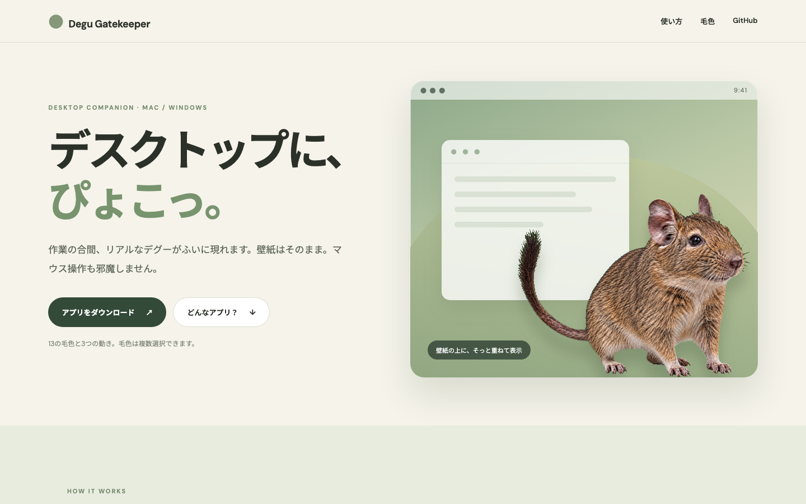
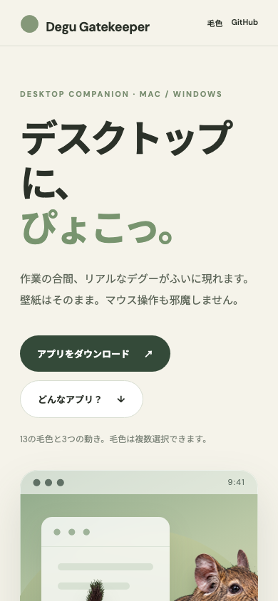

- Primary interaction tested: The product page download button currently opens the generic GitHub Releases asset list.
- Evidence-backed failures: The user says the GitHub asset list is hard to understand. The earlier page requires leaving the product page to choose a file; its narrow mobile heading wraps awkwardly. A browser viewport measurement found no horizontal overflow.
- Existing strengths to preserve: Calm cream and green palette, realistic degu image, short Japanese copy.

## Constraints / 制約

- Product and business: Three installer choices: Intel Mac, Apple Silicon Mac, Windows x64. ZIP is secondary.
- Technical and component system: Static GitHub Pages, existing CSS and assets; direct links to stable asset names in the latest GitHub Release.
- Content and localization: Japanese and English pages. Explain Intel versus M chip and macOS 12 minimum without jargon. Language links preserve the current page type.
- Performance: No JavaScript or extra network request required to reveal download links.
- Accessibility: Native links, visible focus, readable text and sufficient tap area.
- Supported viewports and devices: Desktop 1440 px, mobile 390 px and 320 px.

## Directions considered / 検討案

### Expand the landing page only

- Core idea: Replace its last callout with three download buttons.
- Hierarchy and interaction: Users scroll through all product content before choosing a build.
- Strengths: One page to maintain.
- Risks: The download action stays below a long color gallery.
- Reference: Current product page baseline above.

### Dedicated download chooser

- Core idea: A short page opens with three equal OS choices and direct download buttons.
- Hierarchy and interaction: Choose chip or Windows, click download, then read installation help if needed.
- Strengths: The main job appears in the first viewport; each file has a clear label and recovery option.
- Risks: Requires keeping asset filenames stable in the release workflow.
- Reference: [AnimalsDesktop public download hierarchy](https://udteach.github.io/AnimalsDesktop/) and selected wireframe below.

### One detected download button

- Core idea: Infer OS in the browser and make one dominant button.
- Hierarchy and interaction: Automatic suggestion with hidden alternate platforms.
- Strengths: Fewer first-screen options.
- Risks: Browser OS detection cannot reliably distinguish an Intel Mac from Apple Silicon.
- Reference: None.

## Selected direction / 採用案

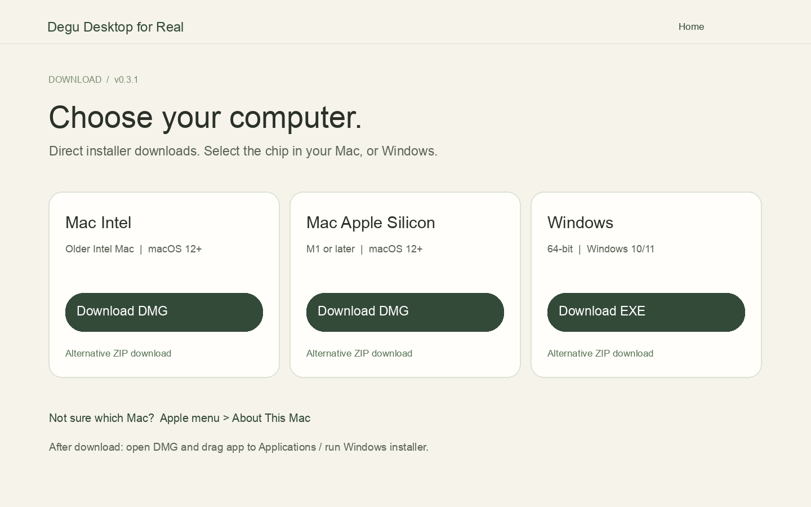

- Selected: Dedicated download chooser.
- Why it wins: All three options are visible and unambiguous without relying on browser detection.
- Rejected ideas and why: The landing-only path delays the task; detection can suggest the wrong Mac file.
- Provisional assumptions, if any: None. The user chose Degu Desktop with a “For Real” tagline.
- Authoritative reference paths and dimensions: This 1440 × 900 wireframe, current `docs/style.css`, and the AnimalsDesktop download guidance.

## User flow and information architecture / 導線と情報設計

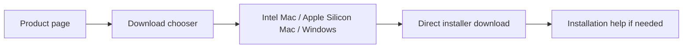

- Navigation: Product page primary action and footer callout open the chooser; chooser links back to product details. The header switches between Japanese and English versions of the current page.
- First viewport order: Page title, compatibility sentence, three installer choices.
- Progressive disclosure: ZIP alternatives and install guidance follow the main buttons.
- Error recovery: Latest release link and ZIP alternatives remain available if a browser blocks a direct download.

## Visual system / ビジュアルシステム

- Design principles: Download choice first; familiar product palette; plain labels; little decoration.
- Typography roles and actual fonts: Existing DM Sans and Noto Sans JP stack, large heading and clear card titles.
- Color roles and contrast intent: Cream background, dark green primary buttons, dark text; labels do not rely on color alone.
- Spacing/grid: Maximum 1200 px content width; three columns on desktop, one column on mobile.
- Radius/border/elevation rules: Use existing soft radii; borders distinguish choices without heavy shadows.
- Icons and imagery: Existing degu asset may appear as a small accent; platform names remain text.
- Motion and reduced-motion behavior: The download page has no animation. The product page previews the three WebM clips in browsers that support VP9 and animated WebP conversions in WebKit, where transparent VP9 WebM has a known grey-background bug. Reduced-motion settings prevent autoplay. A still image remains if media fails. Mobile motion controls sit below the preview so they do not cover the mock desktop window.
- Design-token source or mapping: Existing `docs/style.css` colors and type.

## Responsive behavior / レスポンシブ

| Region | Desktop | Mobile | Failure to prevent |
| --- | --- | --- | --- |
| Navigation | Brand and product link | Brand and short back link | Overflow |
| Primary content | Three OS columns | One OS choice per row | Tiny buttons |
| Help | Compact two-column guidance | One column | Long line clipping |

## Component states / 状態設計

| Component or flow | Default | Loading | Empty | Error/recovery | Disabled | Success |
| --- | --- | --- | --- | --- | --- | --- |
| Direct link | Visible installer label | None | None | ZIP and release links | None | Browser download starts |

## Accessibility / アクセシビリティ

- Heading/landmark structure: One h1, semantic main and sections.
- Keyboard and focus order: OS cards then alternate links then help; visible focus ring.
- Accessible names and announcements: Each button names OS, architecture, and file type.
- Contrast and non-color cues: Text labels and dark green buttons on light surfaces.
- Zoom/reflow/touch targets: Full-width mobile action links, no horizontal overflow at 320 px.
- Motion/media alternatives: Image is decorative; no auto motion on the download page.

## Copy and terminology / 文言

- Voice: Short, direct Japanese.
- Preferred verbs: 選ぶ、ダウンロード、開く。
- Public terminology: Intel Mac, M1以降のMac, Windows 64-bit, macOS 12以降。
- Forbidden internal terms: arm64 as the main user-facing label, CI, artifacts, release job.
- AI-origin disclosure location, if required: Product page footer.
- Exact visible text source: `docs/download.html` and `docs/index.html`.

## Implementation acceptance / 実装受け入れ条件

- [x] Primary interaction links to stable, named release assets.
- [x] Desktop and mobile after-screens match the selected hierarchy.
- [x] Download alternatives and video fallback states exist.
- [x] Native links/buttons, visible focus, and reduced-motion behavior are present.
- [x] No horizontal overflow at 1440, 390, or 320 px in Chrome viewport checks.
- [x] Public copy names chips and OS versions plainly.
- [x] The download page needs no JavaScript; the demo uses the three existing 1.5–2.1 MB WebM clips and three 0.8–1.3 MB WebP conversions for WebKit.
- [x] Mobile demo starts with the full-body center-hop clip; the entire mock is visible at 390×844 and 320×780.
- [x] Japanese and English mobile headers, preview controls, and download pages have no horizontal overflow at 390 px and 320 px.
- [x] Mobile motion controls start below the preview card; the card and controls do not overlap.
- [x] Mismatch ledger has no unexplained release blocker.

## Evidence and mismatch ledger / 証拠と差分

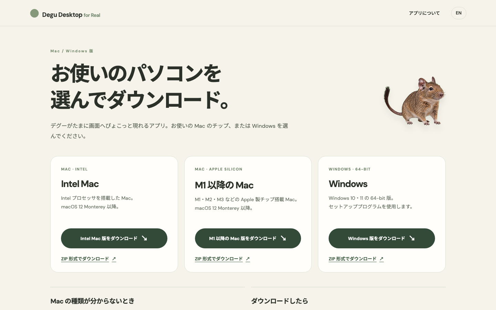
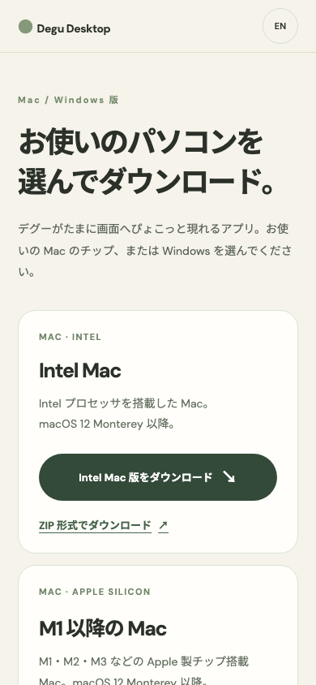
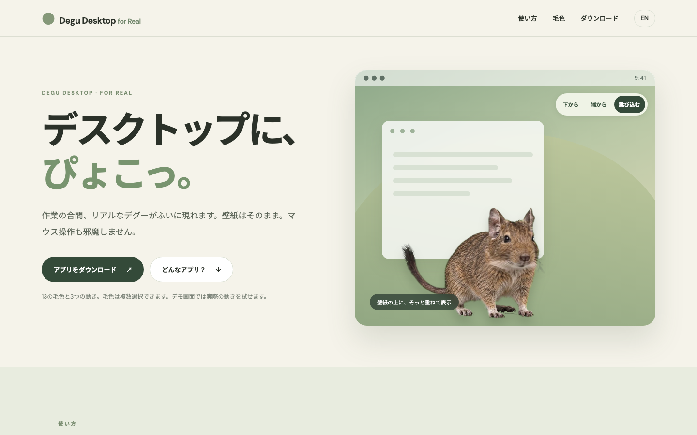
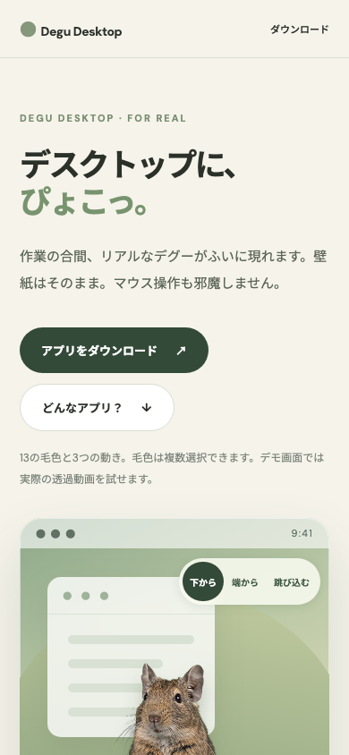
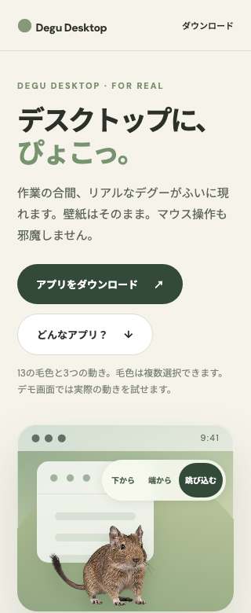
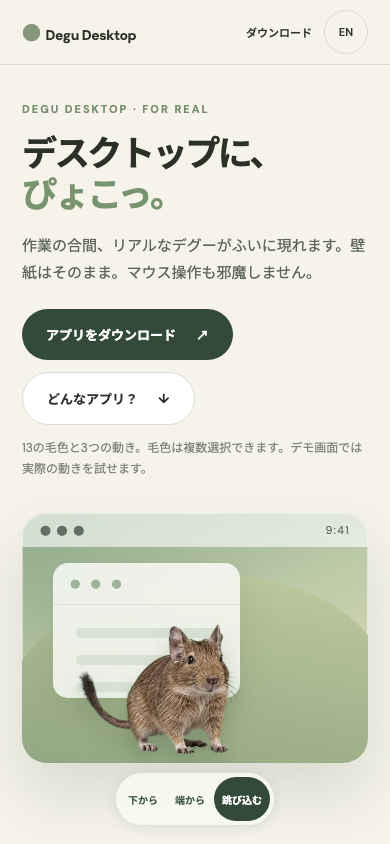
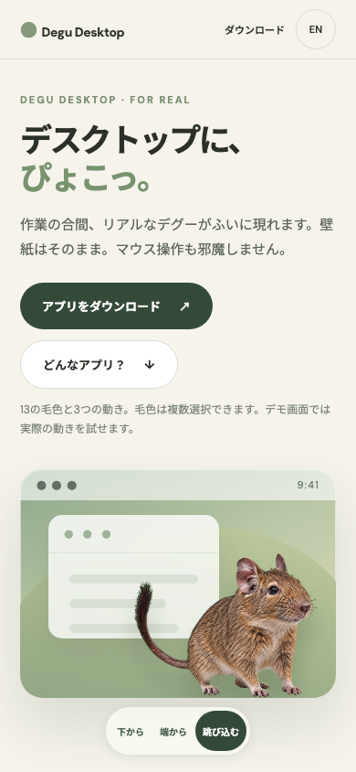
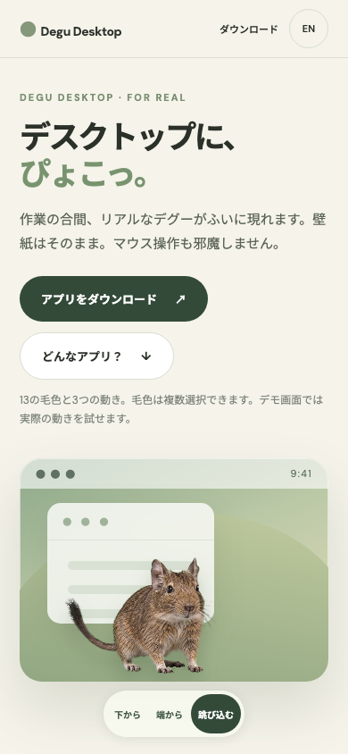
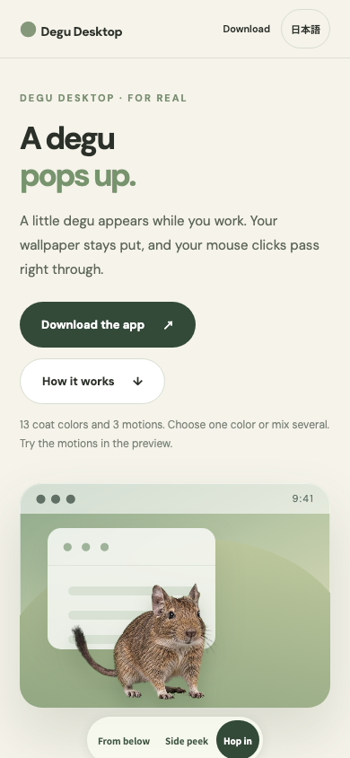
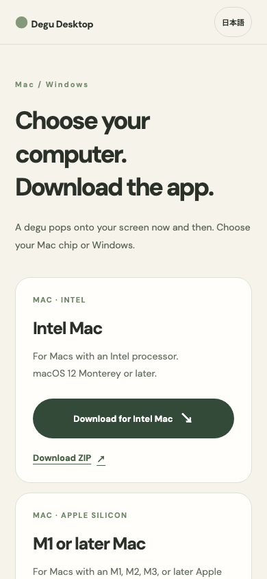

| View/state | Baseline | Target | Implemented | Mismatch | Decision |
| --- | --- | --- | --- | --- | --- |
| Desktop download | Current landing screenshot | Three visible OS choices | `download-desktop.png` | No blocker | Accepted |
| Mobile download | Long landing journey | Single-column choices | `download-mobile.png`, `download-mobile-320.png` | No blocker | Accepted |
| Motion preview | Static degu image and a clipped mobile first view | Real three-motion playback with a full degu in the mobile first view | `demo-desktop.png`, `demo-mobile.png`, `chrome-320.png`, `safari-webp-390.png` | Physical iPhone Safari was unavailable; WebKit path was checked with Safari user agent in Chrome | Accepted with device QA pending |
| Mobile motion controls | Controls covered the mock desktop window | Controls below the preview card | `home-ja-mobile-controls.png`, `home-ja-mobile-320.png` | None at 390 px and 320 px | Accepted |
| English pages | Japanese only | Product and download pages with direct links | `home-en-mobile.png`, `download-en-mobile.png` | None at 390 px and 320 px | Accepted |

## Open decisions / 未決事項

- None.

## v0.5.0 mode settings and tray guide

- Primary job: Start or stop Pomodoro and Degu swarm from the tray, then adjust focus and break lengths without searching through many menus.
- Baseline: The existing interval dialog sets the app's quiet cream and green form style. The product page explained app behavior but did not tell people where to find the tray controls. 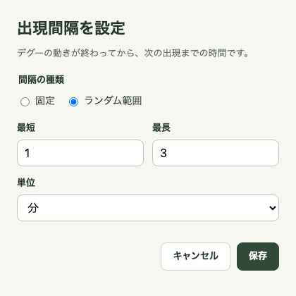
- Constraints: Keep the desktop wallpaper and clicks intact; keep the app bilingual; keep the timer optional and click-through; show five animals in swarm mode without requiring a new video asset.
- Directions considered: **Tray-only** would bury duration fields; **separate windows per mode** would repeat controls; **one grouped settings window plus quick tray toggles** keeps frequent actions immediate and fields together. Selected the grouped window.
- Selected hierarchy: Pomodoro toggle and durations, countdown visibility, swarm toggle, then Save. The site guide first explains the paw icon's location, then the three new actions. Existing colors, field shapes, and typography are reused.
- Interaction: Turning Pomodoro on starts a focus period. Its countdown can be hidden without stopping the timer. Focus suppresses automatic animals; a break begins with an animal. Swarm shows five clips at once and honors focus suppression. The explicit Show now command remains available.
- Verification: The Japanese and English settings windows fit at 500×600 with no overflow; the 190×64 timer fits focus and break labels; five alpha WebMs play simultaneously and clear on stop. The Japanese and English site guides have no horizontal overflow at 1440, 390, or 320 px.

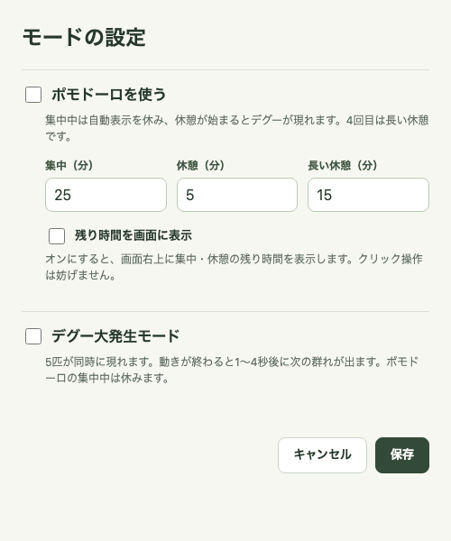
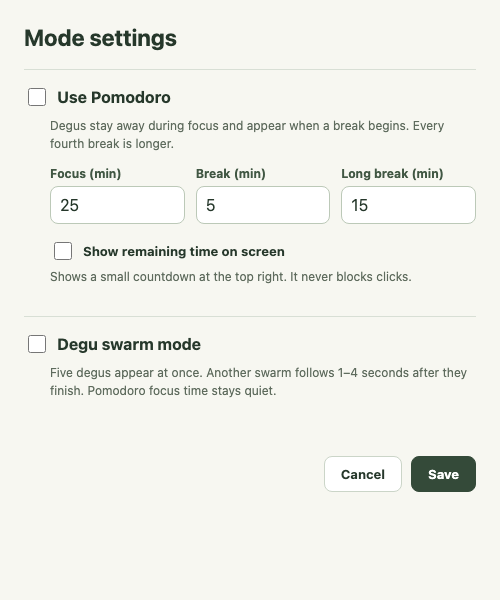

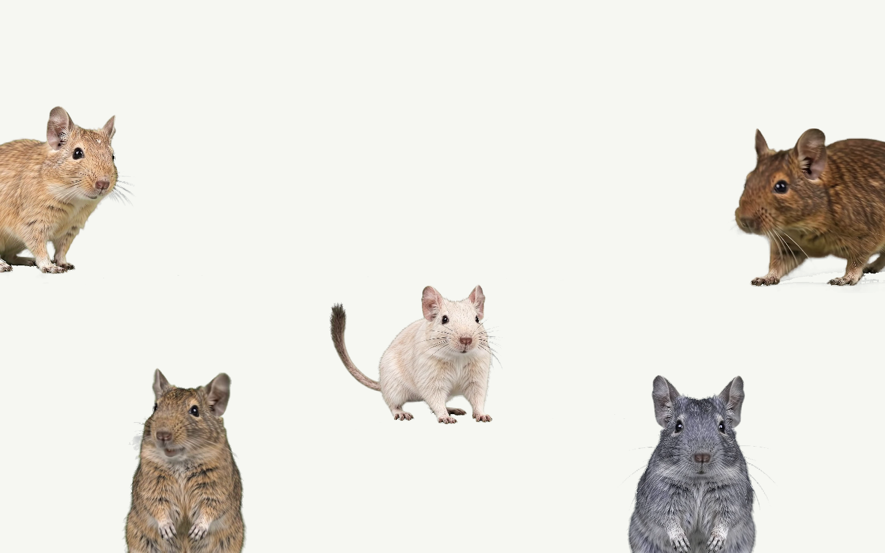
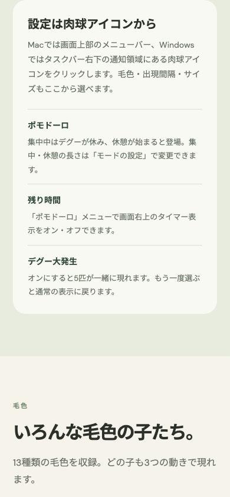
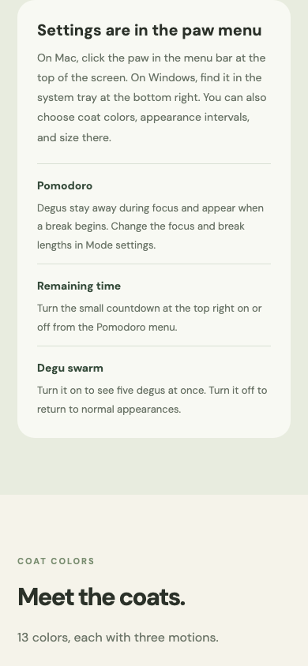

| State | Intended result | Evidence | Mismatch |
| --- | --- | --- | --- |
| Mode settings | One bilingual form with quick tray toggles | `modes-ja.png`, `modes-en.png` | None at 500×600 |
| Countdown | Optional small click-through overlay | `timer-focus.png` | None at 190×64 |
| Swarm | Side peeks meet the left/right screen edges; bottom pops meet the bottom edge; one hop remains inside | `swarm.png` | None at 1440×900 |

In v0.5.1, the swarm slots follow each clip's entry direction. The left side-peek is mirrored so its cut edge lands on the left screen edge. A 1440×900 playback capture confirms the five clips decode and no animal is cut at an interior video boundary.
| Tray guide | Clear steps in both languages on narrow screens | `guide-ja-mobile.png`, `guide-en-mobile.png` | None at 390 px and 320 px |

## Reference provenance / 参照元

| Reference | Source/owner | License or access note | What may be reused |
| --- | --- | --- | --- |
| Existing product page | This repository | Project-owned | Palette, type, degu asset |
| AnimalsDesktop public page | UDteach | User's own reference | Download hierarchy and compatibility explanation |
| [WebKit VP9 alpha bug](https://bugs.webkit.org/show_bug.cgi?id=275908) | WebKit Bugzilla | Public technical issue | Browser fallback decision |
| [Safari 14 WebP support](https://webkit.org/blog/11340/new-webkit-features-in-safari-14/) | WebKit | Public technical documentation | Transparent animated WebP compatibility |
